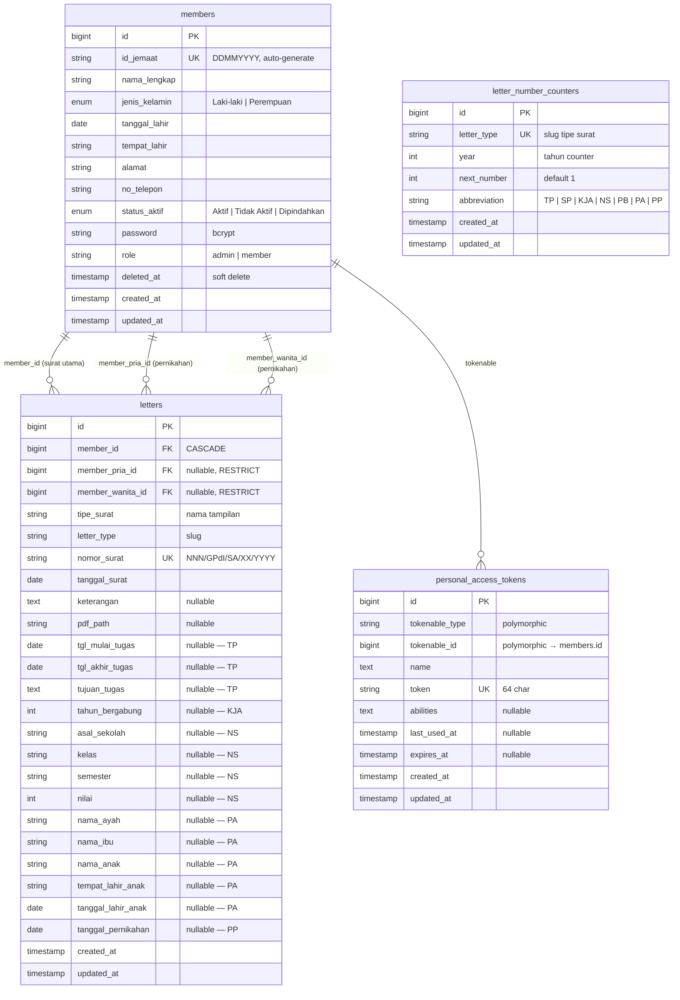
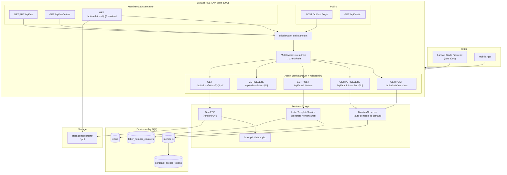
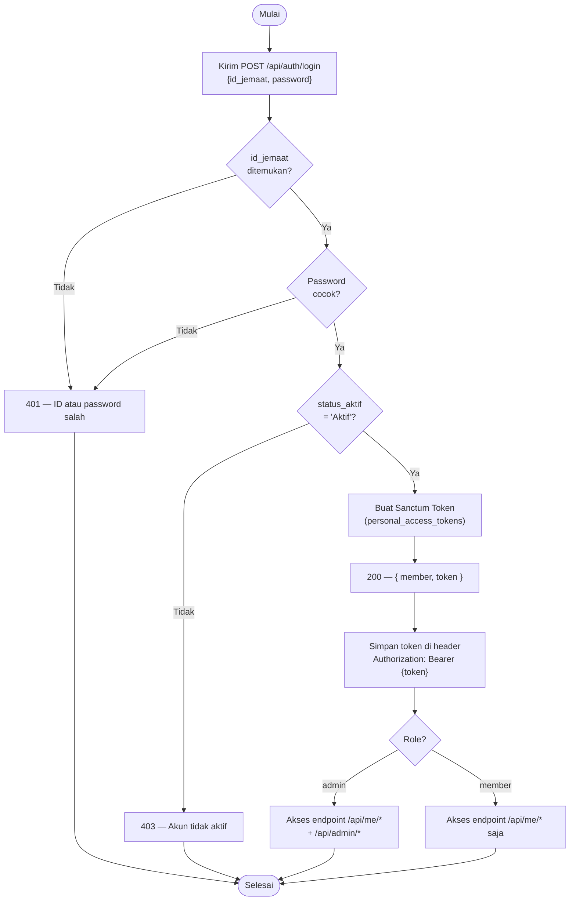
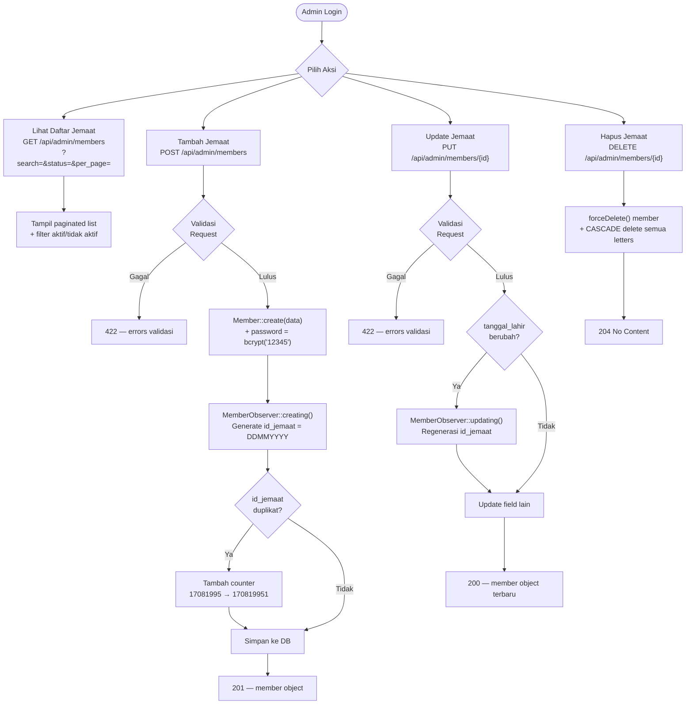
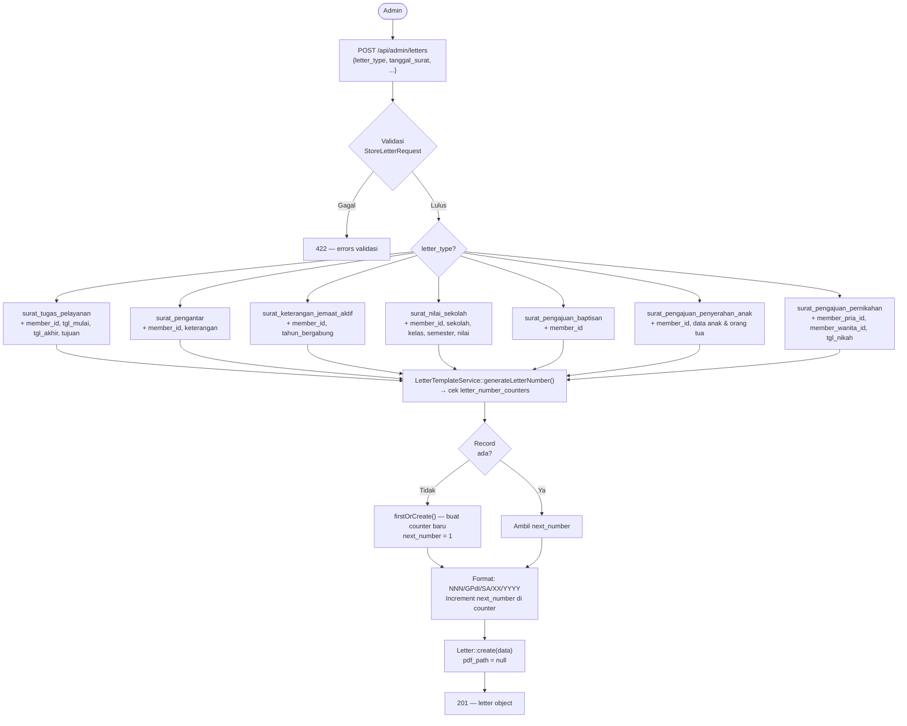
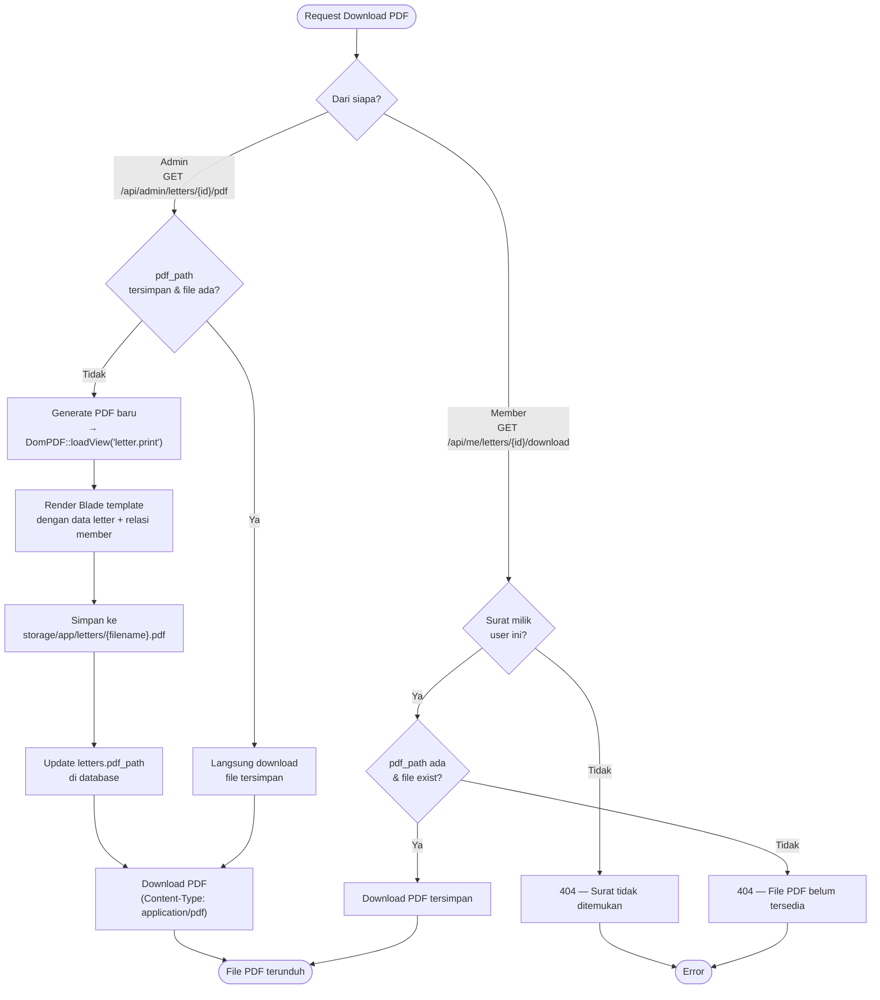
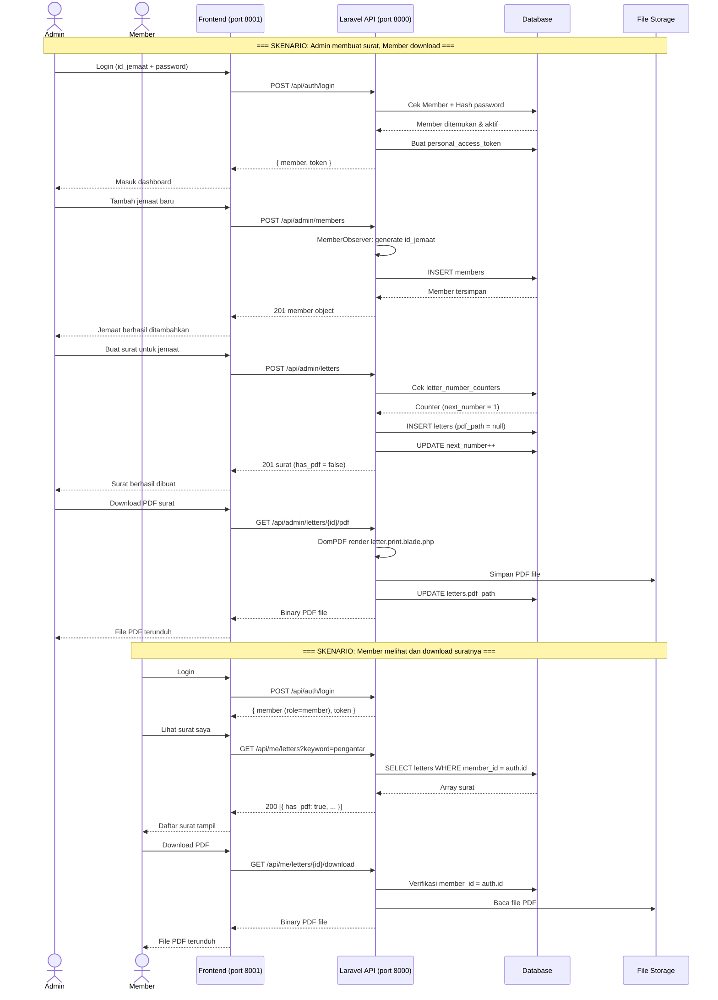
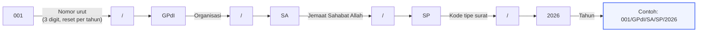
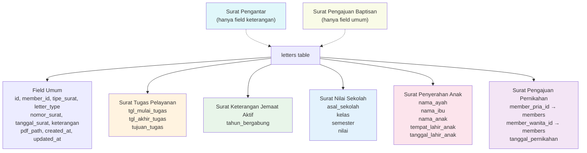

# Diagram Sistem — Sekretariat Jemaat GPdI

---

## 1. Skema Database (ERD)

---

## 2. Arsitektur Sistem

---

## 3. Alur Autentikasi

---

## 4. Alur Manajemen Jemaat (Admin)

---

## 5. Alur Pembuatan Surat (Admin)

---

## 6. Alur Download PDF

---

## 7. Alur Lengkap Sistem (End-to-End)

---

## 8. Struktur Nomor Surat

| Kode | Tipe Surat |
|------|-----------|
| TP | Surat Tugas Pelayanan |
| SP | Surat Pengantar |
| KJA | Surat Keterangan Jemaat Aktif |
| NS | Surat Nilai Sekolah |
| PB | Surat Pengajuan Baptisan |
| PA | Surat Pengajuan Penyerahan Anak |
| PP | Surat Pengajuan Pernikahan |

---

## 9. Relasi Tipe Surat → Field Database

